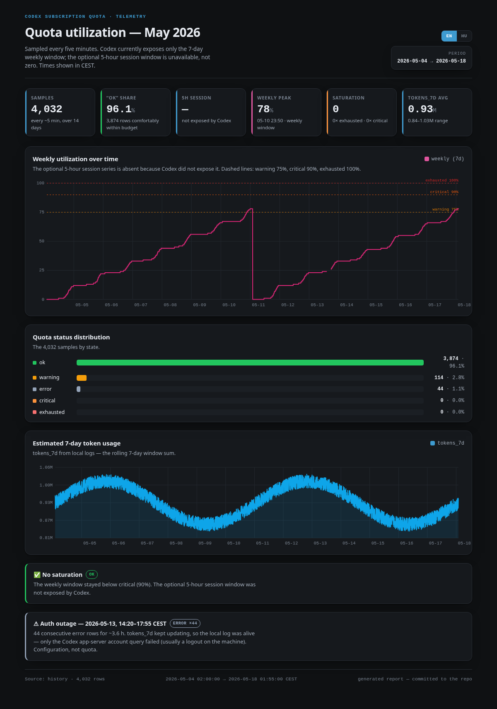

# codex-usage-status

<!-- TEMPLATE_BANNER_START -->
> **This is the shareable template.** Every measurement in `status.json`,
> `history/`, and `sample/` is deterministic dummy data -- never real account
> or Codex session data. Create a **private** repository from this template for
> your own monitor, because its future history will contain your usage figures.
<!-- TEMPLATE_BANNER_END -->

Automated monitor for Codex subscription quota. A cron job runs every 5 minutes,
refreshes [`status.json`](status.json), and publishes it when the reading changes
meaningfully.

## Quick start

You need an always-on machine with Codex CLI installed and logged in.

When starting from the public repository, click **Use this template → Create a
new repository**, and make the new repository **private**. Its future history
will contain your own usage figures. Clone that private repository onto the
always-on machine, then check the login and run the monitor:

```sh
./codex-usage-check.sh
cat status.json
```

If `quota_status` is `error`, make sure Codex CLI is logged in on this machine.

Schedule it every 5 minutes with cron (`crontab -e`):

```
*/5 * * * * ~/codex-usage-status/codex-usage-check.sh >/dev/null 2>&1
```

Cron restarts with the machine, so this survives reboots. Watch `status.json` and
`history/` fill up over the next hour.

Let agents use it by pointing their project instructions at
[ORCHESTRATOR_PROMPT.md](ORCHESTRATOR_PROMPT.md). If the agent runs on the same
machine, point it at the local file. If it runs elsewhere (browser, another
host), have it `git pull` this **private** repo first — a plain link will not be
readable, but an authenticated clone/pull works.

> **Keeping an agent current after you update this repo.** A `git pull` refreshes
> the *code*: the agent runs `budget_check.py` fresh each time, so new script
> behaviour applies automatically — you don't need to explain the internals. But
> an agent that already loaded `ORCHESTRATOR_PROMPT.md` into its context earlier
> keeps its *old* understanding; pulling the file to disk does not change what the
> agent already read. So after the prompt or scripts change, tell the agent to
> **`git pull` and then re-read `ORCHESTRATOR_PROMPT.md`** — otherwise it will
> interpret the new output (e.g. `CACHED`, `UNKNOWN`, a `[conserve]` tag) with the
> old rules.

Optionally pick a spending strategy — see *Spending strategy* below to
make agents burn the whole allowance or keep a reserve for you.

That's it. From here the sections below explain what each field means and how the
pieces work.

## What it does

1. **Quota** — starts `codex app-server` and calls the supported
   `account/rateLimits/read` JSON-RPC method. Codex manages authentication and
   token refresh. No model turn is started, so it costs no tokens.
2. **Estimate** — separately scans local session logs
   (`~/.codex/sessions/**/*.jsonl`) and sums final session token counters for 7 days.
3. **Publish** — writes `status.json` and commits + pushes it.

Authentication failures are returned as an explicit `quota_status: error`; the
monitor never spends tokens to repair authentication.

> **About the 5-hour session window:** Codex currently returns only the weekly
> window for this account shape. Therefore `session_percent_used` and
> `session_resets_at` are `null` and the dashboard shows the session as
> unavailable — never as zero. The collector still understands the optional
> 300-minute window, so it will appear automatically if OpenAI exposes it again.

## Spending strategy (`budget_check.py`)

`budget_check.py` turns the quota into a `GO` / `CAUTION` / `STOP` verdict for
orchestrators (see [ORCHESTRATOR_PROMPT.md](ORCHESTRATOR_PROMPT.md)). How
aggressive it is depends on a profile:

| profile | intent |
|---|---|
| `balanced` (default) | spend freely, stop before the window runs out |
| `greedy` | use nearly the whole allowance before pulling back |
| `conserve` | protect a reserve — warn and stop early (e.g. leave half the week) |

```sh
BUDGET_PROFILE=conserve python3 budget_check.py --brief
```

Any single threshold can be overridden without a profile, e.g. stop weekly work
at 50%:

```sh
BUDGET_WEEKLY_STOP=50 python3 budget_check.py --brief
```

A non-default profile is shown in the output (e.g. `STOP | [conserve] | …`) so a
conservative stop is never mistaken for a near-empty account.

## What you get

| field | meaning |
|---|---|
| `session_percent_used` | optional 5-hour window; `null` when Codex does not expose it |
| `weekly_percent_used` | 7-day window utilization (real), from the `codex` limit group |
| `max_percent_used` | the worst of all active limits, across every limit group |
| `limits[]` | every limit window, including model-scoped ones |
| `session_group` / `weekly_group` | which limit group each headline figure came from |
| `account` | which Codex account was authenticated when the reading was taken |
| `session_resets_at` / `weekly_resets_at` | reset time for each exposed window; missing windows stay `null` |
| `quota_status` | `ok` <75%, `warning` ≥75%, `critical` ≥90%, `exhausted` 100% |
| `estimated_tokens_7d` | approximate token count from local logs |

## What the monitoring costs

Nothing on the collection side, and next to nothing on the agent side.

- The **cron runner** spends no tokens: `fetch_limits.py` calls the local
  app-server account method and `estimate_tokens.py` reads local files.
- The **agent-side check** (`budget_check.py --brief`, as instructed by
  [ORCHESTRATOR_PROMPT.md](ORCHESTRATOR_PROMPT.md)) costs one tool call plus a
  single line of output — and that is the part worth measuring, because an agent
  is told to run it repeatedly.

`budget_check.py` is a local process that reads the normalized status (or asks
the token-free app-server account method for a fresh snapshot). It never starts
a model turn. Its one-line verdict adds only that line to an agent's context;
this template deliberately ships no measurements from a maintainer session.

## Accuracy notes

- The **percentages are authoritative** — they come from OpenAI's servers.
- The **token counts are an approximation**. They cover only sessions logged on
  this machine, and do not map linearly onto the percentages (different models
  consume quota at different rates). `estimated_tokens_7d` counts plain input +
  output; cache reads and writes are reported separately in `usage_breakdown_7d`,
  because they are orders of magnitude larger and would distort the total.

## Files

| file | purpose |
|---|---|
| `codex-usage-check.sh` | the runner invoked by cron |
| `budget_check.py` | GO/CAUTION/STOP verdict for agents ([prompt](ORCHESTRATOR_PROMPT.md)) |
| `fetch_limits.py` | real quota fetcher |
| `estimate_tokens.py` | 7-day token estimator |
| `status.json` | latest result (overwritten each run) |
| `history/YYYY-MM.jsonl` | one compact line per run, for trends |
| `history/YYYY-MM.html` | the published report for that month; rebuilt, committed & pushed each meaningful reading |
| `build_dashboard.py` | turns a history file into an offline HTML dashboard |
| `sample/2026-05.jsonl` | synthetic demo data to try the dashboard right away |
| `sample/2026-05.html` | a rendered demo report, committed so it's visible without running anything |
| `run.log` | local run log, git-ignored |

## Schedule and publishing

```
*/5 * * * * ~/codex-usage-status/codex-usage-check.sh
```

Cron restarts with the machine, so this survives a reboot with no extra setup.

`status.json` and the history file are refreshed **every 5 minutes locally**, but
a commit is only pushed when the reading actually means something:

- `quota_status` changed (e.g. `ok` → `warning`)
- any headline percentage moved by ≥1 point
- the local 7-day token estimate changed (active Codex work)
- the quota error state changed
- nothing has been published for 6 hours (heartbeat)

This keeps idle periods quiet while publishing five-minute graph points during
active Codex work. History lines written while nothing changed are not lost —
they ride along with the next commit.

### Coverage

The **percentages are account-wide**: they come from OpenAI's servers, so
usage from any machine, the phone app, or codex.ai is included. The **token
estimate is machine-local** — it only sees sessions logged on this host. Sessions
driven remotely (e.g. from the web UI) still count as local when the agent runs
here.

## Dashboard



*Preview of [`sample/2026-05.html`](sample/2026-05.html) — two weeks of synthetic demo data, not real usage.*

`build_dashboard.py` turns any monthly history file into a single, self-contained
HTML dashboard — KPI tiles, the currently exposed quota windows with warning /
critical / exhausted thresholds, the status mix, the token trend, and
auto-detected saturation and auth-error episodes. Session-specific charts are
shown only when Codex actually supplies the optional 5-hour window. The page has an
**EN/HU language toggle** (English by default) and shows all times in the **local
timezone of the machine that builds it** (via `$TZ`), so the report reads in your
own local time — the stored history stays UTC.

```sh
python3 build_dashboard.py history/2026-07.jsonl
# -> history/2026-07.html  (open it in any browser)
```

It is **offline and LLM-free**: pure Python standard library, no network calls.
Everything is computed from the jsonl and embedded into the page; the charts draw
client-side with vanilla JavaScript. A full month (~8,900 lines) builds in well
under a second. By default the report is written **next to its data**
(`history/2026-07.jsonl` → `history/2026-07.html`), so months stay together and
the repo root stays clean.

The generated `history/<month>.html` **is committed and published** — it is the
report, part of the repo, not a throwaway. GitHub does not render HTML inline, so
to read it open the raw file in a browser (Raw → save, or `git pull` and open it
locally). A committed sample is included so you can see one immediately without
cloning-and-running:

- **[`sample/2026-05.html`](sample/2026-05.html)** — a rendered demo report built
  from `sample/2026-05.jsonl` (two weeks of synthetic readings, not real usage).
  Rebuild it with:

  ```sh
  python3 build_dashboard.py sample/2026-05.jsonl   # -> sample/2026-05.html
  ```

You can delete the `sample/` directory once you've seen it; `make_sample.py` in
there regenerates the demo data deterministically if you ever want it back.

**Live view.** `codex-usage-check.sh` rebuilds `history/<current-month>.html`
whenever a reading is worth committing (the same "something changed" signal used
for git — so it does not rewrite the file on every 5-minute run) and **commits and
pushes it alongside `status.json`**. The report on GitHub therefore tracks the
latest meaningful reading on its own. The rebuild is gated to the still-open
month, so it rolls over to a new file on the 1st with no configuration.

## Running on Windows

The core (`budget_check.py`, `fetch_limits.py`, `estimate_tokens.py`) runs
unmodified on Windows 11 with **Git Bash + Task Scheduler**. A few
platform-specific gotchas (thanks to a user who ported it):

- **Line endings.** The repo ships a `.gitattributes` that pins `*.sh`/`*.py`
  to LF, so a default clone (`core.autocrlf=true`) can't rewrite the scripts to
  CRLF — which otherwise makes bash fail with `python3^M: command not found`. If
  you cloned *before* this file existed, re-normalise once:
  `git add --renormalize . && git checkout .`.

- **`python3` doesn't exist.** The runner automatically falls back to `python`
  or `py`. You can also create a venv and pass its interpreter explicitly. The
  venv interpreter lives at `.venv\Scripts\python.exe` (not `.venv/bin/python`):

  ```sh
  py -m venv .venv
  PYTHON_BIN="$(pwd)/.venv/Scripts/python.exe" ./codex-usage-check.sh
  ```

- **Running the script by hand.** Typing `bash` on Windows often launches WSL,
  not Git Bash. Use the full path:

  ```powershell
  & "C:\Program Files\Git\bin\bash.exe" -lc "'/c/Users/YOU/codex-usage-status/codex-usage-check.sh'"
  ```

- **Scheduling (cron replacement).** Use Task Scheduler. To avoid a black
  console window flashing every 5 minutes, launch a tiny hidden VBS via
  `wscript.exe` instead of calling `bash.exe` directly. Save `run-hidden.vbs`:

  ```vbscript
  Set sh = CreateObject("WScript.Shell")
  cmd = """C:\Program Files\Git\bin\bash.exe"" -lc ""'/c/Users/YOU/codex-usage-status/codex-usage-check.sh'"""
  sh.Run cmd, 0, False
  ```

  Then a Task Scheduler task, every 5 minutes: program `wscript.exe`, argument
  the full path to `run-hidden.vbs`. If your machine's clock is UTC but you want
  local time in the report, set `TZ=Europe/Budapest` (or your zone) in the task's
  environment.

The Python entry points already force UTF-8 output, so the `→` in the log line
won't crash on a cp1250/cp1252 console.

## Privacy

No secrets, account identifiers, name or email are ever written to this repo —
only quota figures. Credentials are never read by this project; Codex app-server
owns authentication. Opaque reset-credit IDs are deliberately discarded.

## Template repository

The public template has a separate, clean Git history and contains synthetic
measurements only. Maintainer-side mirroring is handled by `sync-template.sh`;
`template_guard.py` checks an explicit file allowlist, credential and identity
patterns, and the exact dummy fixtures before any public commit is made. Those
maintainer files stay in the private working repository and are not shipped in
the template.
